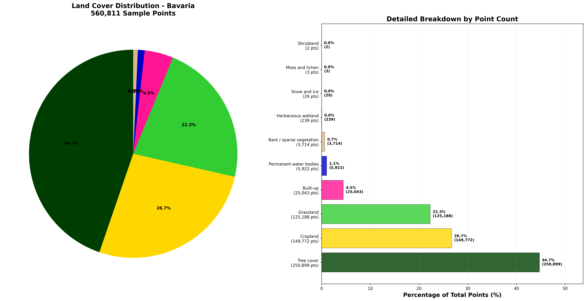
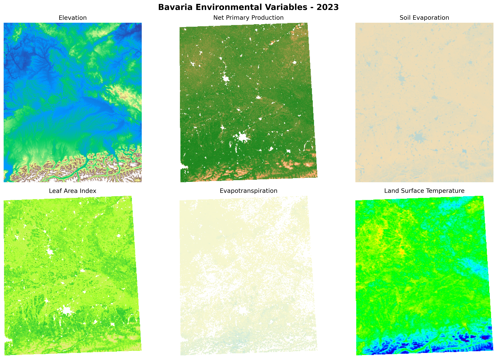

# Bavaria Land Cover and Environmental Mapping

This repository contains scripts for creating comprehensive maps of Bavaria, Germany, including land cover classification and environmental variables. The project uses Google Earth Engine (GEE) to extract and visualize spatial data.

## Overview

The project generates three main types of maps:

1. **Land Cover Maps** - Classification of land use/land cover using ESA WorldCover data
2. **Environmental Variable Maps** - Six key environmental bands for 2023
3. **Final Predictions** - Soil Organic Carbon (SOC) mapping results

## Scripts

### 1. ```landCoverLandUseMaps.py```
**Purpose**: Extracts and visualizes land cover data for Bavaria with highly visible point-based visualization.

**Key Features**:
- Loads Bavaria boundary from GeoJSON
- Filters coordinates to Bavaria region
- Extracts land cover data from ESA WorldCover v100 (2020)
- Creates high-quality visualizations with enhanced point visibility
- Generates comprehensive statistics and charts
- Supports multiprocessing for large datasets

**Land Cover Classes** (ESA WorldCover):
- Tree cover (10)
- Shrubland (20) 
- Grassland (30)
- Cropland (40)
- Built-up (50)
- Bare/sparse vegetation (60)
- Snow and ice (70)
- Permanent water bodies (80)
- Herbaceous wetland (90)
- Mangroves (95)
- Moss and lichen (100)





### 2. ```GEEMaps2023.py```
**Purpose**: Creates raster maps of environmental variables for Bavaria in 2023.

**Environmental Variables**:
1. **Elevation** - SRTM Digital Elevation Model
2. **Net Primary Production** - MODIS NPP data
3. **Soil Evaporation** - PML evaporation data
4. **Leaf Area Index** - MODIS LAI data
5. **Evapotranspiration** - MODIS ET data
6. **Land Surface Temperature** - MODIS LST data

**Outputs**:
- GeoTIFF files for each variable
- PNG visualizations with custom colormaps
- 1km resolution, 800x800 pixels




### 3. ```landcover_extraction.py```
**Purpose**: Simplified land cover extraction script for batch processing.

## Installation

### Prerequisites
```bash
pip install earthengine-api
pip install geemap
pip install numpy
pip install matplotlib
pip install pandas
pip install geopandas
pip install rasterio
pip install scipy
pip install tqdm
```

### Google Earth Engine Setup
1. Create a Google Earth Engine account
2. Install and authenticate the Earth Engine Python API:
```bash
earthengine authenticate
```

## Usage

### Land Cover Mapping
```bash
python landcovermap.py --start 0 --end 10000 --batch-size 500 --output-dir ./bavaria_landcover_results
```

**Parameters**:
- ```--start```: Start index of coordinates (default: 0)
- ```--end```: End index of coordinates (default: all)
- ```--batch-size```: Batch size for GEE requests (default: 500)
- ```--workers```: Number of parallel workers (default: CPU count)
- ```--output-dir```: Output directory (default: ./bavaria_landcover_VISIBLE)
- ```--coordinates-path```: Path to coordinates numpy file

### Environmental Variable Mapping
```bash
python GEEMaps2023.py
```

This script runs automatically and creates a ```Bavaria_Bands_2023``` directory with:
- GeoTIFF files for each environmental variable
- PNG visualizations with custom colormaps

### Simple Land Cover Extraction
```bash
python landcover_extraction.py
```

## Output Files

### Land Cover Mapping Outputs
- ```bavaria_coordinates_YYYYMMDD_HHMMSS.npy``` - Processed coordinates
- ```bavaria_landcover_values_YYYYMMDD_HHMMSS.npy``` - Land cover class values
- ```bavaria_landcover_VISIBLE_YYYYMMDD_HHMMSS.png``` - High-resolution visualization
- ```bavaria_landcover_VISIBLE_YYYYMMDD_HHMMSS.pdf``` - PDF version
- ```bavaria_landcover_ENHANCED_stats_YYYYMMDD_HHMMSS.csv``` - Detailed statistics
- ```bavaria_landcover_ENHANCED_charts_YYYYMMDD_HHMMSS.png``` - Statistical charts

### Environmental Variable Outputs
- ```Elevation.tif``` / ```Elevation.png```
- ```Net_Primary_Production.tif``` / ```Net_Primary_Production.png```
- ```Soil_Evaporation.tif``` / ```Soil_Evaporation.png```
- ```Leaf_Area_Index.tif``` / ```Leaf_Area_Index.png```
- ```Evapotranspiration.tif``` / ```Evapotranspiration.png```
- ```Land_Surface_Temperature.tif``` / ```Land_Surface_Temperature.png```

## Technical Details

### Coordinate System
- **Projection**: EPSG:4326 (WGS84)
- **Region**: Bavaria, Germany (9.5°E-13.9°E, 47.2°N-50.6°N)

### Data Sources
- **Land Cover**: ESA WorldCover v100 (2020) - 10m resolution
- **Elevation**: USGS SRTMGL1 v003 - 30m resolution
- **NPP**: MODIS MOD17A3HGF v061 - 500m resolution
- **Soil Evaporation**: CAS PML v2 - 500m resolution
- **LAI**: MODIS MOD15A2H v061 - 500m resolution
- **ET**: MODIS MOD16A2 v006 - 500m resolution
- **LST**: MODIS MOD11A2 v061 - 1km resolution

### Performance Optimization
- Multiprocessing support for large datasets
- Batch processing to avoid GEE memory limits
- Progress bars for monitoring
- Error handling and recovery

## Project Context

This mapping workflow is part of a larger Soil Organic Carbon (SOC) mapping project for Bavaria. The land cover and environmental variable maps serve as input features for machine learning models (XGBoost and Random Forest) that predict SOC distribution across the region.

## Notes

- The scripts require active Google Earth Engine authentication
- Large coordinate datasets may take considerable time to process
- Output files can be large (several GB for full Bavaria coverage)
- The visualization parameters are optimized for Bavaria's geographic shape and extent

