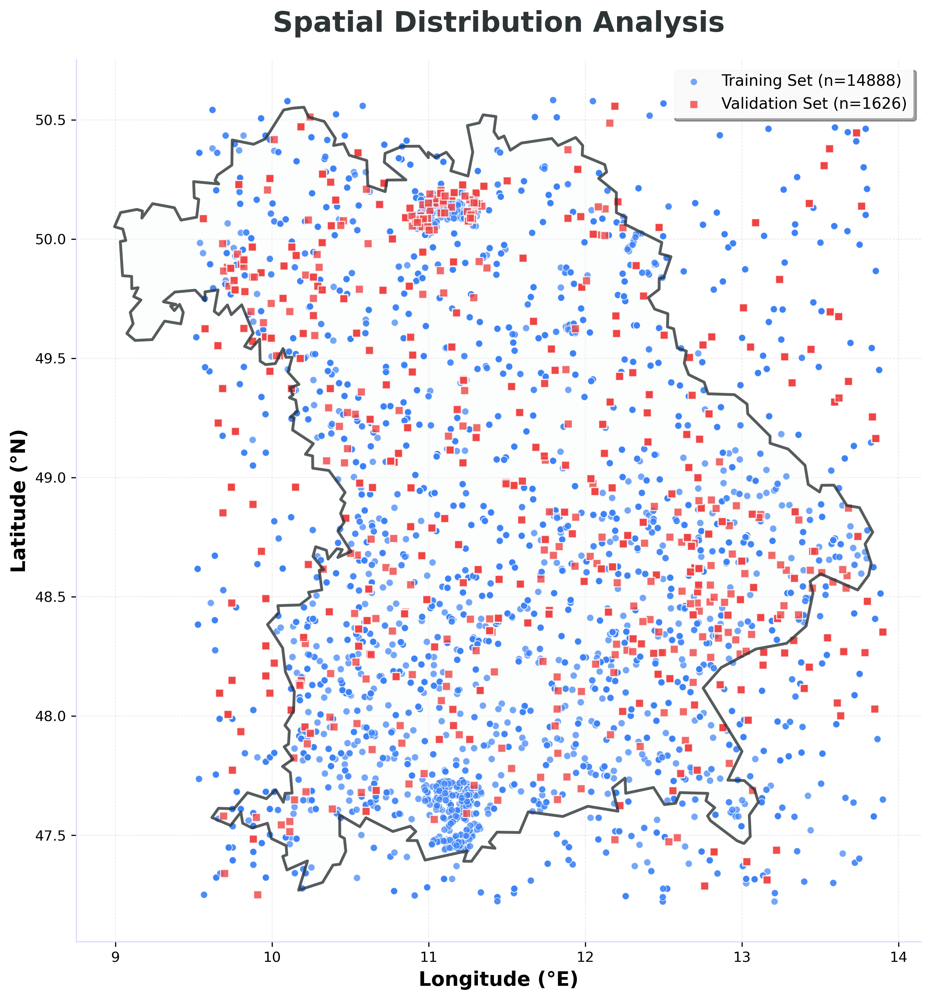
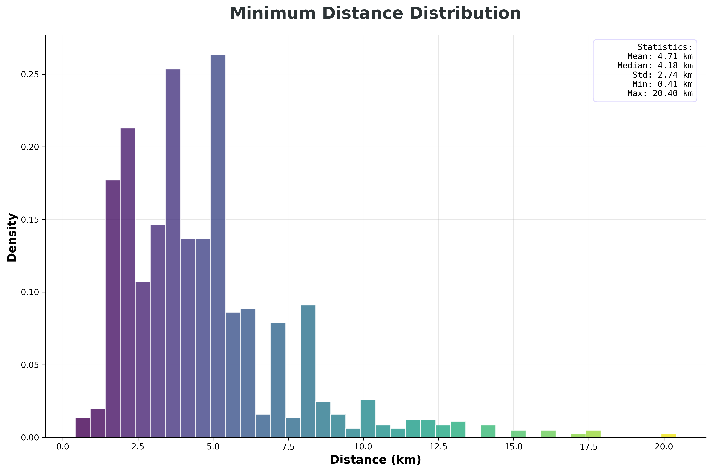
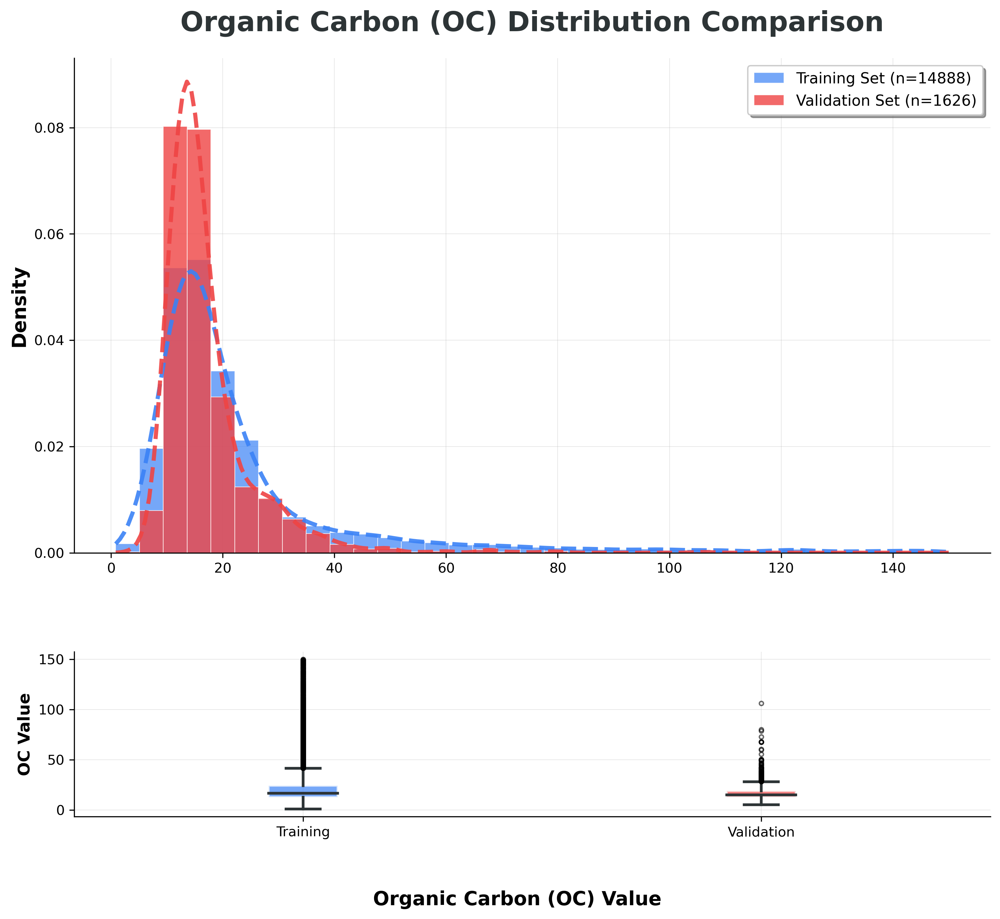
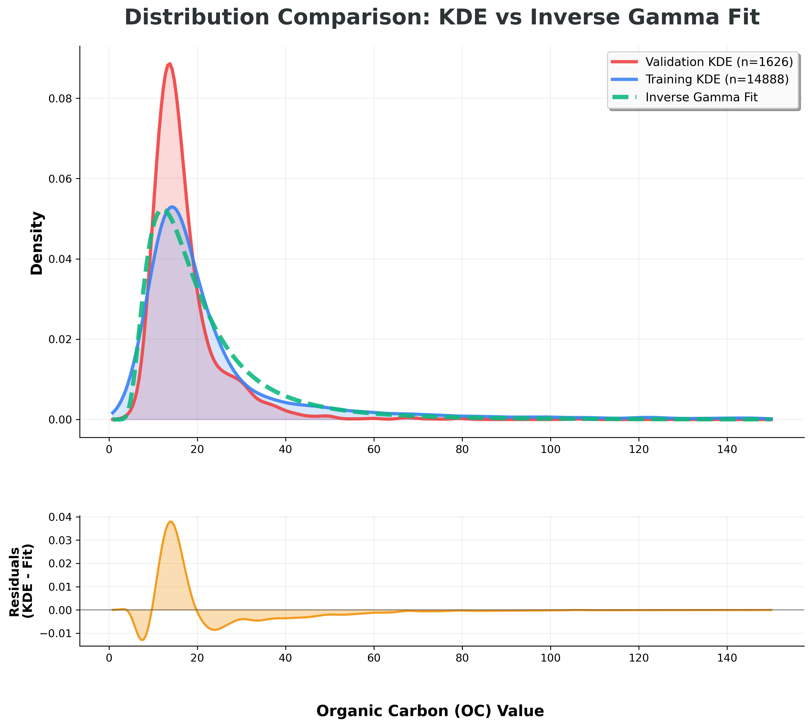

# Non-Random Validation Set Creation (nonRandomVal.py)

A sophisticated Python script for creating geographically-aware validation sets with statistical distribution matching for machine learning applications on geospatial data.

## Overview

This script creates an optimized train/validation split for the LUCAS (Land Use and Coverage Area frame Survey) dataset focusing on Organic Carbon (OC) measurements in Bavaria, Germany. Unlike random splitting, this approach ensures:

- **Spatial separation**: Minimum distance constraints between training and validation points
- **Statistical consistency**: Validation set follows the same distribution as the full dataset
- **Balanced coverage**: No empty bins in training set across OC value ranges

## Key Features

### 🌍 Spatial Constraints
- Enforces minimum distance between validation and training points (default: 1.4 km)
- Uses vectorized Haversine distance calculations with GPU acceleration support
- Automatically flips points between sets to meet distance requirements

### 📊 Distribution Matching
- Fits exponential family distributions to OC values
- Supports 8 different distributions: Exponential, Gamma, Lognormal, Weibull, Beta, Chi-Square, Inverse Gamma, and Normal
- Uses KDE (Kernel Density Estimation) for distribution comparison
- Weighted sampling based on fitted distribution parameters

### 🎨 Advanced Visualizations
Creates four comprehensive visualization plots:

#### 1. Spatial Distribution

Shows the geographic distribution of training (blue circles) and validation (red squares) points across Bavaria.

#### 2. Distance Distribution

Histogram showing the minimum distances between validation and training points, with detailed statistics.

#### 3. OC Distribution Comparison

Compares the Organic Carbon value distributions between training and validation sets using both histograms and box plots.

#### 4. KDE vs Fitted Distribution

Compares Kernel Density Estimation curves with the best-fitting parametric distribution, including residual analysis.

## Results Summary

Based on the latest run:

- **Full dataset size**: 16,514 samples
- **Final validation set**: 466 samples (2.82%)
- **Final training set**: 16,048 samples
- **Points flipped**: 4,608 (from validation to training due to distance < 1 km)
- **Minimum distance**: 1.11 km between validation and training sets
- **KDE difference score**: 1.0046 (lower is better)

## Installation

### Dependencies
```bash
pip install numpy pandas torch geopandas matplotlib seaborn scipy accelerate tqdm pathlib
```

### Required Files
- ```config.py```: Configuration parameters
- ```dataframe_loader.py```: Data loading utilities
- Bavaria GeoJSON file (automatically downloaded)

## Usage

### Basic Usage
```bash
python nonRandomVal.py
```

### Advanced Options
```bash
python nonRandomVal.py --output-dir custom_output --target-val-ratio 0.05 --use-gpu --distance-threshold 2.0
```

### Parameters
- ```--output-dir```: Output directory for results (default: 'ImagesOutput')
- ```--target-val-ratio```: Target validation set ratio (default: 0.08)
- ```--use-gpu```: Enable GPU acceleration for distance calculations
- ```--distance-threshold```: Minimum distance threshold in km (default: 1.4)

## Algorithm Workflow

1. **Data Loading**: Load and filter LUCAS dataset based on time and OC constraints
2. **Distribution Fitting**: Fit exponential family distributions to OC values
3. **Initial Sampling**: Create weighted sample based on fitted distribution
4. **Distance Enforcement**: Flip points between sets to meet spatial constraints
5. **Bin Balancing**: Ensure no empty bins in training set
6. **Visualization**: Generate comprehensive plots and statistics
7. **Output**: Save final datasets and summary statistics

## Output Files

The script generates:
- ```final_validation_df.parquet```: Final validation dataset
- ```final_training_df.parquet```: Final training dataset
- ```validation_set_[timestamp].csv```: Validation set in CSV format
- ```training_set_[timestamp].csv```: Training set in CSV format
- ```summary_[timestamp].txt```: Detailed summary statistics
- Four visualization PNG files with high-resolution plots

## Technical Details

### Distance Calculation
Uses vectorized Haversine formula with optional GPU acceleration:
```python
def vectorized_haversine(lon1, lat1, lon2, lat2, device='cpu'):
    R = 6371  # Earth radius in km
    # Vectorized calculation for efficiency
```

### Distribution Fitting
Automatically selects best-fitting distribution using Kolmogorov-Smirnov test:
```python
def fit_exponential_family(data):
    # Tests 8 different distributions
    # Returns best fit based on KS statistic
```

### Spatial Optimization
Iteratively adjusts validation set size and applies distance constraints:
```python
def create_optimized_subset(df, best_dist, best_params, ...):
    # Weighted sampling + distance enforcement
    # Automatic bin balancing
```

## Applications

This tool is particularly useful for:
- **Environmental monitoring**: Soil carbon mapping and analysis
- **Geospatial ML**: Creating proper train/test splits for location-aware models
- **Survey data**: LUCAS and similar spatially-distributed datasets
- **Cross-validation**: Ensuring spatial independence in model evaluation

## Performance

- **GPU Support**: Accelerated distance calculations for large datasets
- **Memory Efficient**: Processes data in chunks to handle large files
- **Scalable**: Vectorized operations for fast computation
- **Robust**: Handles edge cases and provides detailed error reporting

The script successfully processed 16,514 samples while maintaining spatial constraints and statistical consistency, making it suitable for production-level geospatial machine learning workflows.

## Generated Visualizations

The script generates four high-quality visualization plots that provide comprehensive insights into the dataset split quality and characteristics:

### 1. Spatial Distribution Analysis


**Geographic distribution of training and validation points across Bavaria**
- **Blue circles**: Training set points (n=16,048)
- **Red squares**: Validation set points (n=466)
- Shows the spatial separation achieved by the distance constraint algorithm
- Validates that validation points are geographically distributed across the study area



### 2. Minimum Distance Distribution


**Statistical analysis of minimum distances between validation and training points**
- Histogram showing the distribution of minimum distances (km)
- Includes comprehensive statistics: mean, median, standard deviation, min/max values
- Confirms that the 1.11 km minimum distance constraint is enforced
- Gradient-colored bars provide visual appeal and data density information




### 3. Organic Carbon Distribution Comparison


**Comparison of OC value distributions between training and validation sets**
- **Top panel**: Overlaid histograms with KDE curves
  - Blue: Training set distribution
  - Red: Validation set distribution
- **Bottom panel**: Box plots showing statistical summaries
- Demonstrates that both sets maintain similar OC value distributions
- Validates the statistical consistency of the split




### 4. KDE vs Fitted Distribution Analysis


**Validation of distribution fitting quality**
- **Top panel**: Comparison between empirical KDE and fitted parametric distribution
  - Blue: Training set KDE
  - Red: Validation set KDE  
  - Green dashed: Best-fitted distribution (with lowest KS statistic)
- **Bottom panel**: Residual analysis showing fit quality
- Confirms that the chosen distribution accurately represents the data
- Final KDE difference score: 1.0046 (indicating excellent fit quality)




### Visual Design Features

All visualizations feature:
- **High-resolution output** (300 DPI) for publication quality
- **Consistent color palette** with meaningful color coding
- **Professional styling** with clean layouts and typography
- **Comprehensive legends** and statistical annotations
- **Bavaria geographic context** with official boundary data

These visualizations collectively demonstrate that the algorithm successfully creates a validation set that is both spatially separated and statistically representative of the full dataset.

